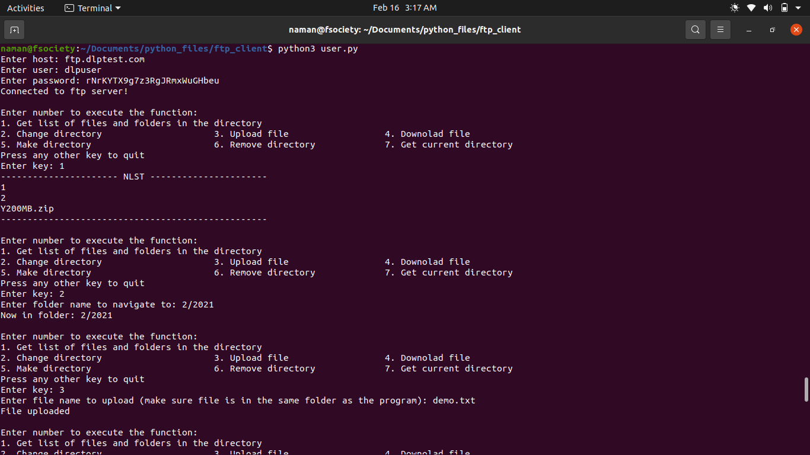
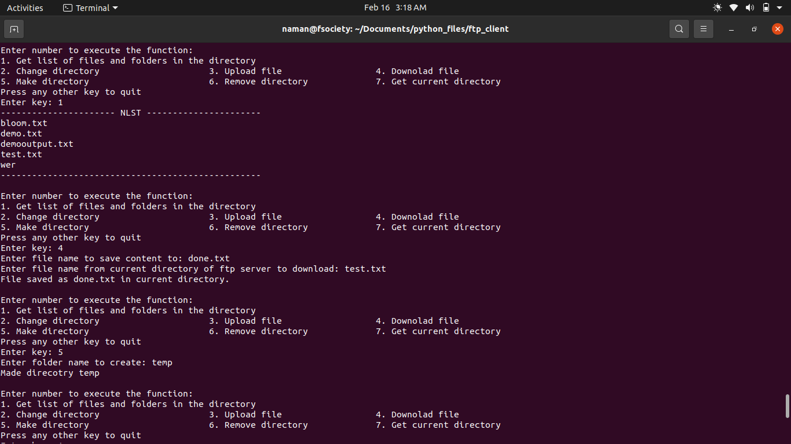
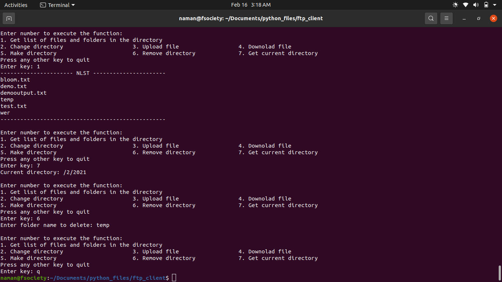

# Port Scanner with Multithreading
Python script for a FTP client in the form of a menu driven program.
 Functionality:
- List files and navigate folders in directories
- Upload and download files
- Create and delete folders

### Prerequisites
All libraries used in the script are a part of 'python standard library', no additional installs required.

### How to run the script
- Select an FTP server and get its login credentials (public FTP server for testing purpose: [here](https://dlptest.com/ftp-test/))
- Run the 'ftp_client.py' file in command line (make sure you're running the program through the same location as the python file).
- Enter correct hostname, user, and password when promted.
- After log in, follow instructions given in the program.
- Screenshots of script execution:

